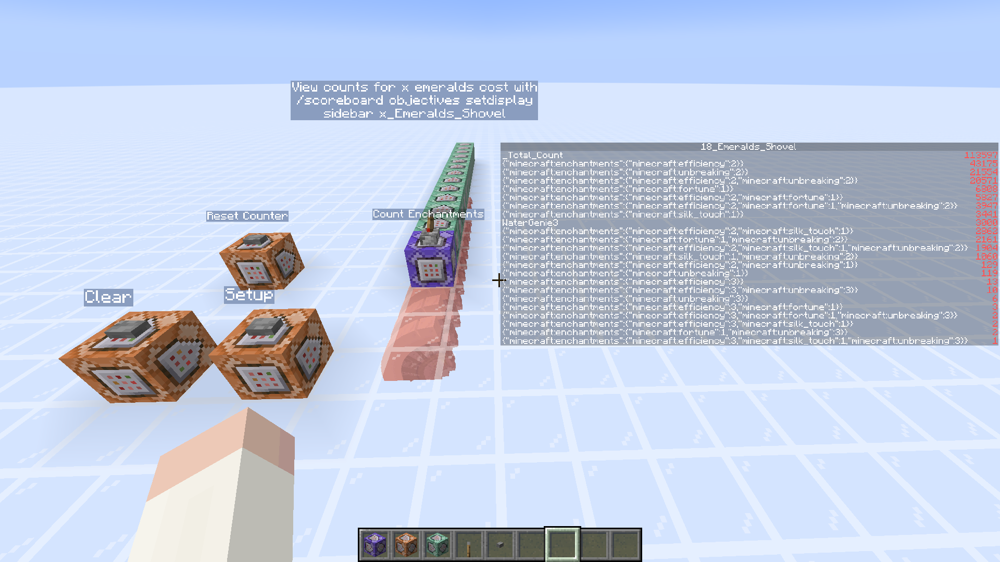

# Count Enchant Combinations Datapack

Ad-hoc datapack to count how many times each set of enchantments and cost
appears on a diamond shovel from level 4 toolsmith.

## Usage

1. Initialise with `genie:villager_enchant_trade_counter/diamond_shovel/setup` function.
2. Sample a level 4 toolsmith with `genie:villager_enchant_trade_counter/diamond_shovel/sample` function.
3. Clean-up with `genie:villager_enchant_trade_counter/diamond_shovel/clear` function.

## Future Reference

### Implementation Details

 - A way to reference the entity from a summon command?
   - Currently I just give them a tag and select the closest one.
 - A way to extract enchantment data from the villager nbt?
   - Currently I just shove the whole enchantment component into a scoreboard as a player name.
 - A way to pass multiple arguments to a function?
   - Currently I expand this out into several manual calls to similarly defined functions instead.
 - A way to access nbt data inside macros?
   - Currently I just didn't dig into the nbt and used the whole enchantment component as-is.

### Abstracting Away from Commands/Datapacks

 - SethBling's [CBScript](https://github.com/SethBling/cbscript)
 - vberlier's [Beet](https://github.com/mcbeet/beet)
 - TheblueMan003's [StarLight](https://github.com/TheblueMan003/StarLight)

## References

- [MCStacker](https://mcstacker.net/)
- [Wiki's datapack article](https://minecraft.wiki/w/Data_pack)
- [Pernsteiner's enchantment probability tables](http://pernsteiner.org/minecraft/enchant/leveltables/Diamond_Tool_index.html)
